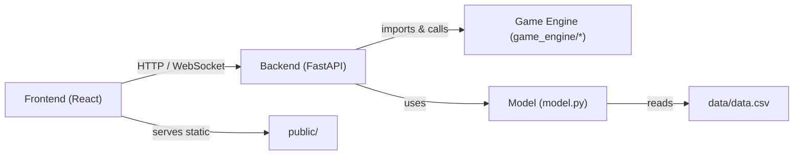

# Architecture — EcoFarm 🏗️

## Component diagram (mermaid)

## Overview

- **Frontend**: A small React app (Vite) with pages and components in `frontend/src/components`. It provides the UI for the game, interacts with the backend via REST (and may use Leaflet for maps).
- **Backend**: FastAPI app in `backend/main.py` exposing metadata, game state, action, plant and recommendation endpoints.
- **Game engine**: `game_engine` contains `CellState`, `GameState`, `Clock` and request models (e.g., `BatchActionRequest`, `PlantRequest`) — core simulation logic lives here.
- **Model**: `model.py` loads `data/data.csv` and computes distance-based crop recommendations.
- **Data**: `data/data.csv` contains labelled soil / crop rows used by the simple recommendation engine.

## Data flow

1. User actions in the frontend (plant, action, tick) call FastAPI endpoints.
2. FastAPI mutates `GameState` (in-memory) and returns updated state JSON.
3. For recommendations, the backend calls `Model.get_recommendations` which reads dataset statistics and returns top crops.

## Design decisions / assumptions

- Game state is kept in-memory (single-player, not persisted). Add persistence if multi-session or long-term storage is required.
- Recommendations are distance-based (no trained black-box model). This is transparent, deterministic and easy to reproduce.

**Questions / TODOs**
- Should we persist games (DB design)? (Yes/No) — If yes, which DB? Postgres/SQLite?
- Do we need authentication for multiplayer or saved states?
- Add sequence diagrams for common flows (init → plant → tick → harvest).